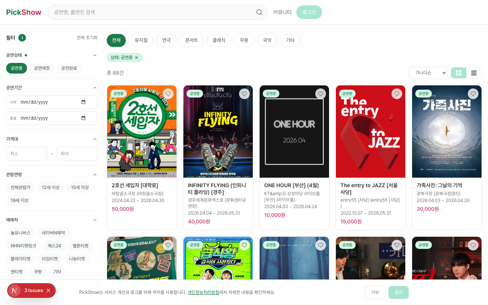
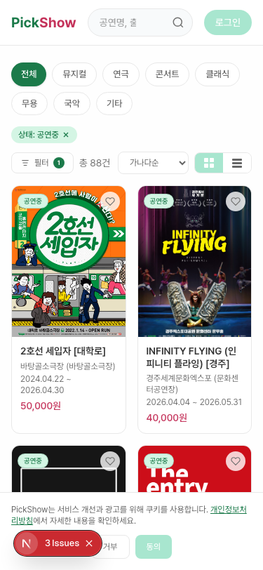
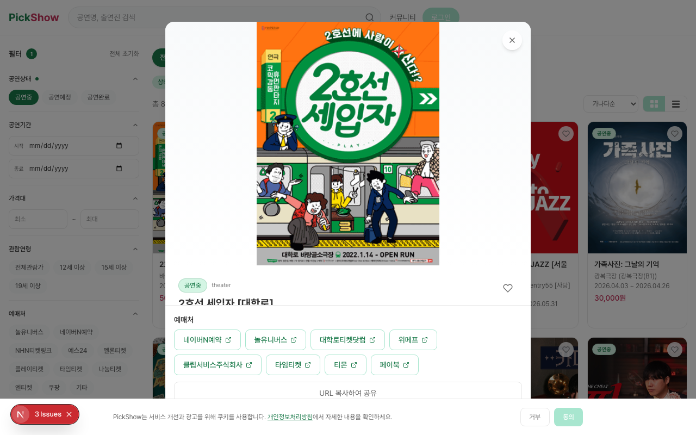
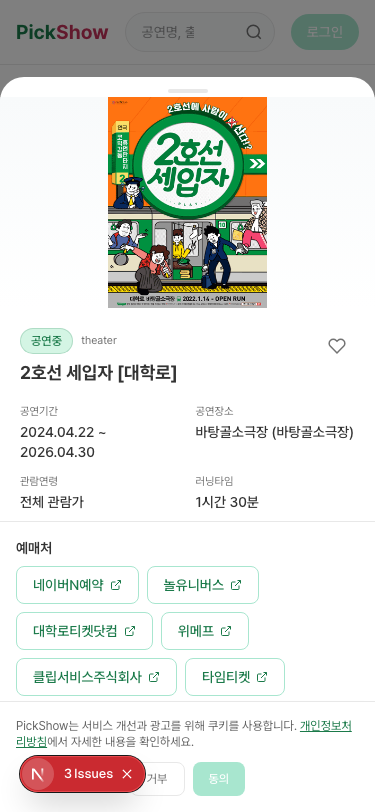
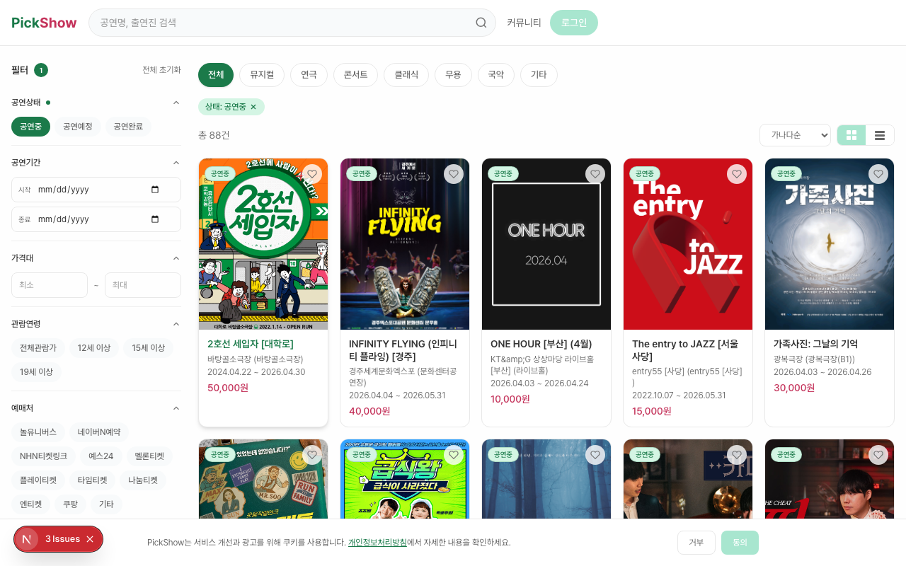
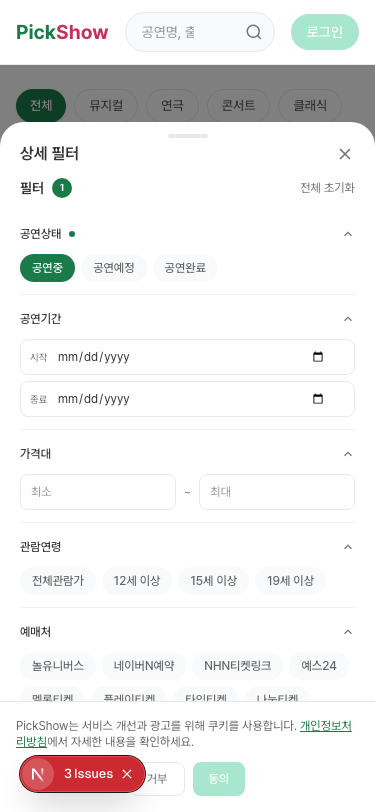
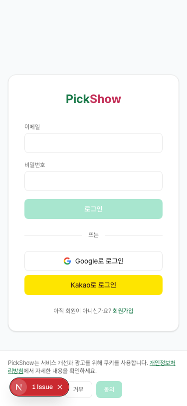
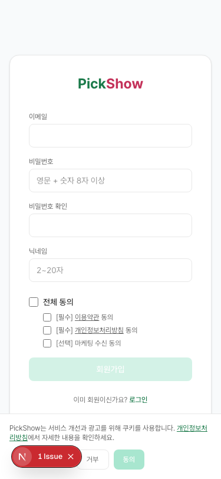

# PickShow (픽쇼)

> 공연 예매처 통합 검색 서비스 — 공연정보를 검색하고 예매사이트로 바로 연결

[](https://pickshow.vercel.app)

**Production**: https://pickshow.vercel.app
**Swagger API Docs**: https://pickshow.vercel.app/api-docs
**GitHub**: https://github.com/yes0735/pickshow

---

## 서비스 소개

공연을 예매하려면 어떤 플랫폼(인터파크, YES24, 멜론티켓 등)에서 판매하는지 일일이 찾아봐야 합니다. **PickShow**는 KOPIS(공연예술통합전산망) 공공 데이터를 기반으로 공연정보를 통합 검색하고, 해당 공연의 예매처 링크를 한 곳에서 바로 연결해주는 서비스입니다.

---

## 주요 기능

### 1. 공연 검색 + 예매처 연결

KOPIS 데이터 기반 9,600건+ 공연 정보를 통합 검색합니다. 검색 결과에서 공연을 클릭하면 예매처(놀유니버스, 네이버N예약, NHN티켓링크 등)로 바로 이동할 수 있습니다.

- 키워드 통합 검색 (공연명, 출연진)
- 장르 칩 필터 (뮤지컬, 연극, 콘서트, 클래식, 무용, 국악, 기타)
- 상세 필터: 공연상태, 공연기간, 가격대, 관람연령, 예매처(11종), 공연장소
- 카드뷰 / 리스트뷰 전환
- 가나다순 / 가격 낮은순 / 높은순 정렬
- 무한 스크롤 (Intersection Observer)

| Web | Mobile |
|:---:|:------:|
|  |  |

### 2. 공연 상세 + SEO

공연 카드를 클릭하면 URL이 변경되는 모달(Parallel Routes)로 상세 정보를 확인할 수 있습니다. 직접 URL 접근 시 SSR + JSON-LD(Event 스키마)로 SEO에 최적화됩니다.

- 공연 포스터, 기간, 장소, 가격, 출연진, 줄거리
- 예매처 링크 목록 (새 탭 열기)
- 찜 버튼, URL 공유
- 동적 OG 이미지 (포스터 + 공연 정보)

| Web 모달 | Mobile Bottom Sheet |
|:--------:|:-------------------:|
|  |  |

### 3. 검색 필터 (아코디언 + 칩)

데스크톱은 사이드바 아코디언, 모바일은 바텀시트로 상세 필터를 제공합니다.
적용된 필터는 목록 상단에 제거 가능한 태그로 표시됩니다.

- 접이식(아코디언) 섹션 + 활성 필터 뱃지
- 모바일: 슬라이드업 바텀시트 + 적용/초기화 버튼
- 적용 필터 태그 (X 버튼으로 개별 제거)
- 입력 필드 X 버튼 (날짜, 장소)

| Web 사이드바 | Mobile 바텀시트 |
|:-----------:|:--------------:|
|  |  |

### 4. 회원 기능

이메일 + Google + Kakao 소셜 로그인을 지원합니다.

- JWT 인증 (Auth.js)
- 회원가입 시 필수/선택 동의 분리
- 회원 탈퇴 + 개인정보 즉시 파기

| 로그인 | 회원가입 |
|:------:|:-------:|
|  |  |

### 5. 찜 + 내가 본 공연

로그인 사용자는 공연을 찜하거나, 본 공연을 기록할 수 있습니다.

- 공연 찜 등록/해제 (카드, 모달에서 하트 버튼)
- 내가 본 공연: 별점(1~5), 한줄 리뷰, 좌석 정보, 예매처 기록

### 6. 커뮤니티 게시판

익명/회원 게시판과 댓글 기능을 제공합니다.

- 익명 게시판: 닉네임+비밀번호로 글 작성 (카테고리: 홍보/정보/구함)
- 회원 게시판: 로그인 필수 (카테고리: 홍보/정보/양도/구함)
- 댓글 작성/삭제
- 전통 페이지네이션

### 7. KOPIS 배치 동기화

매일 자동으로 KOPIS에서 공연 데이터를 동기화합니다.

- KST 00:00 — 공연 상태 자동 업데이트 (공연중/공연예정/공연완료)
- KST 01:00 — KOPIS 신규 공연 증분 동기화
- 수동 전체 동기화: `npx tsx scripts/full-sync.ts`

### 8. SEO + 광고

- `generateMetadata` — 페이지별 동적 메타 태그
- `sitemap.ts` — 공연 데이터 기반 동적 사이트맵
- `robots.ts` — 크롤러 접근 제어
- JSON-LD Event 스키마 (Google Rich Results)
- 동적 OG 이미지 (`/og`, `/og/performance/[id]`)
- Google AdSense 광고 슬롯

### 9. 개인정보보호

- 개인정보처리방침 (`/privacy`) + 이용약관 (`/terms`)
- 쿠키 동의 배너 (AdSense)
- 비밀번호 bcrypt 해싱
- XSS 방어 (DOMPurify)
- Rate Limiting (proxy.ts)
- 회원 탈퇴 시 개인정보 즉시 파기

---

## 기술 스택

| Layer | Technology |
|-------|-----------|
| Framework | Next.js 16 (App Router, Turbopack) |
| Language | TypeScript (strict mode) |
| Styling | Tailwind CSS (파스텔 민트+핑크 테마) |
| Font | Pretendard Variable |
| Auth | Auth.js v5 (이메일 + Google + Kakao, JWT) |
| ORM | Prisma 7 + @prisma/adapter-pg |
| Database | PostgreSQL (Neon via Vercel Marketplace) |
| State | Zustand (client) + TanStack Query (server) |
| Forms | react-hook-form + zod |
| Security | bcrypt, DOMPurify, Rate Limiting |
| SEO | generateMetadata, JSON-LD, sitemap, OG Image |
| Ads | Google AdSense |
| Deploy | Vercel (Cron Jobs) |
| API Docs | Swagger UI (`/api-docs`) |
| Data | KOPIS 공연예술통합전산망 Open API |

---

## 시작하기

### 사전 준비

- Node.js 20+
- PostgreSQL (Neon 권장)
- KOPIS API Key ([발급](https://www.kopis.or.kr/por/cs/openapi/openApiInfo.do))

### 설치

```bash
git clone https://github.com/yes0735/pickshow.git
cd pickshow
npm install
```

### 환경 변수

`.env.example`을 참고하여 `.env` 파일을 생성합니다.

```bash
cp .env.example .env
```

```env
DATABASE_URL="postgresql://..."
KOPIS_API_KEY="your-kopis-api-key"
NEXTAUTH_SECRET="openssl rand -base64 32"
CRON_SECRET="your-cron-secret"

# 소셜 로그인 (선택)
GOOGLE_CLIENT_ID=""
GOOGLE_CLIENT_SECRET=""
KAKAO_CLIENT_ID=""
KAKAO_CLIENT_SECRET=""

# AdSense (선택)
NEXT_PUBLIC_GA_ID=""
NEXT_PUBLIC_SITE_URL="http://localhost:3000"
```

### DB 마이그레이션 + Seed

```bash
npx prisma migrate dev --name init
npx tsx prisma/seed.ts
```

### KOPIS 데이터 동기화

```bash
# 전체 동기화 (최초 1회, ~30분 소요)
npx tsx scripts/full-sync.ts

# 장르 보정 (선택)
npx tsx scripts/fix-genres.ts
npx tsx scripts/fix-genres-detail.ts
```

### 개발 서버

```bash
npm run dev
```

http://localhost:3000 에서 확인

---

## 프로젝트 구조

```
pickshow/
├── src/
│   ├── app/                    # Next.js App Router
│   │   ├── (auth)/             # 로그인/회원가입
│   │   ├── (main)/             # 메인 레이아웃 + 검색
│   │   │   ├── @modal/         # Parallel Routes (공연 모달)
│   │   │   ├── community/      # 커뮤니티 게시판
│   │   │   ├── my/             # 마이페이지
│   │   │   └── performance/    # 공연 상세 (SEO)
│   │   ├── api/                # API Route Handlers (22개)
│   │   ├── api-docs/           # Swagger UI
│   │   └── og/                 # 동적 OG 이미지
│   ├── components/             # UI 컴포넌트
│   │   ├── performance/        # 공연 관련 (Card, Modal, Filter 등)
│   │   ├── community/          # 게시판
│   │   ├── layout/             # Header, Footer
│   │   ├── ads/                # AdSense
│   │   └── ui/                 # InfiniteScroll, CookieConsent
│   ├── features/               # 비즈니스 로직 모듈
│   │   ├── search/             # 검색 (service, schema, hooks)
│   │   ├── auth/               # 인증
│   │   ├── favorite/           # 찜
│   │   ├── my-performance/     # 내가 본 공연
│   │   ├── community/          # 게시판
│   │   └── batch/              # KOPIS 배치
│   ├── lib/                    # 인프라 (prisma, auth, kopis, seo)
│   └── types/                  # TypeScript 타입
├── prisma/
│   ├── schema.prisma           # DB 스키마 (7 모델)
│   └── seed.ts                 # 공통코드 시드
├── scripts/                    # 수동 실행 스크립트
├── docs/                       # PDCA 문서
└── vercel.json                 # Vercel Cron Jobs
```

---

## API 문서

Swagger UI: https://pickshow.vercel.app/api-docs

### 주요 API

| Method | Path | Description |
|--------|------|-------------|
| GET | `/api/performances` | 공연 검색 (필터, 정렬, 페이징) |
| GET | `/api/performances/[id]` | 공연 상세 |
| GET | `/api/common-codes` | 공통코드 (필터 옵션) |
| POST | `/api/auth/register` | 회원가입 |
| DELETE | `/api/auth/withdraw` | 회원탈퇴 |
| GET/POST | `/api/favorites` | 찜 목록/등록 |
| GET/POST | `/api/my-performances` | 내가 본 공연 |
| GET/POST | `/api/community/posts` | 게시판 |
| POST | `/api/cron/sync-performances` | KOPIS 배치 |

---

## 스크린샷 추가 가이드

`docs/screenshots/` 폴더에 아래 파일명으로 캡처 이미지를 저장하면 README에 자동 표시됩니다.

| 파일명 | 캡처 내용 | 권장 크기 |
|--------|----------|----------|
| `web-search.png` | 웹 메인 검색 화면 (장르칩 + 카드목록) | 1280x800 |
| `mobile-search.png` | 모바일 검색 화면 | 375x812 |
| `web-detail.png` | 웹 공연 상세 모달 | 1280x800 |
| `mobile-detail.png` | 모바일 바텀시트 상세 | 375x812 |
| `web-filter.png` | 웹 사이드바 필터 (아코디언) | 1280x800 |
| `mobile-filter.png` | 모바일 바텀시트 필터 | 375x812 |
| `login.png` | 로그인 페이지 | 375x812 |
| `register.png` | 회원가입 페이지 | 375x812 |

**Chrome DevTools 캡처 방법**:
1. `F12` → `Ctrl+Shift+M` (모바일 토글)
2. 디바이스 선택 (iPhone 14 Pro 등)
3. `Ctrl+Shift+P` → "Capture full size screenshot"

---

## 배포

Vercel에 자동 배포 설정 완료. `main` 브랜치 push 시 자동 빌드+배포.

```bash
# 수동 배포
vercel deploy --prod
```

### Vercel Cron Jobs

| 스케줄 (KST) | 경로 | 역할 |
|-------------|------|------|
| 매일 00:00 | `/api/cron/update-statuses` | 공연 상태 자동 업데이트 |
| 매일 01:00 | `/api/cron/sync-performances` | KOPIS 신규 공연 동기화 |

---

## 라이선스

MIT
